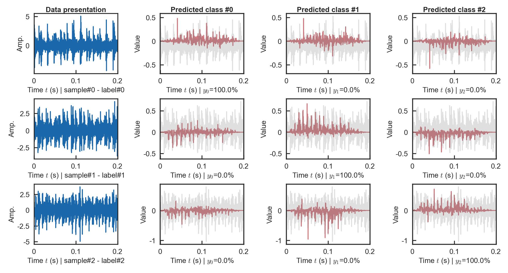
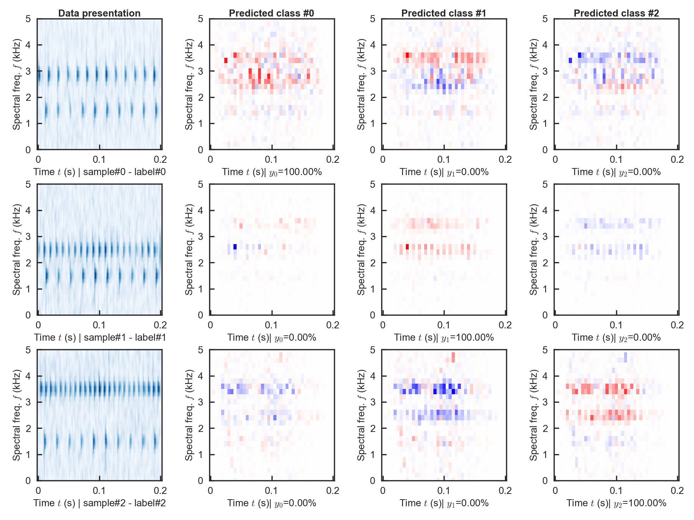

# CS-SHAP
**Open-source implementation of the paper:**  
*"CS-SHAP: Extending SHAP to Cyclic-Spectral Domain for Better Interpretability of Intelligent Fault Diagnosis"*  
[](https://arxiv.org/abs/2502.06424)  

> Neural networks (NNs), with their powerful nonlinear mapping and end-to-end capabilities, are widely applied in mechanical intelligent fault diagnosis (IFD). However, as typical black-box models, they pose challenges in understanding their decision basis and logic, limiting their deployment in high-reliability scenarios. Hence, various methods have been proposed to enhance the interpretability of IFD. Among these, post-hoc approaches can provide explanations without changing model architecture, preserving its flexibility and scalability. However, existing post-hoc methods often suffer from limitations in explanation forms. They either require preprocessing that disrupts the end-to-end nature or overlook fault mechanisms, leading to suboptimal explanations. To address these issues, we derived the cyclic-spectral (CS) transform and proposed the CS-SHAP by extending Shapley additive explanations (SHAP) to the CS domain. CS-SHAP can evaluate contributions from both carrier and modulation frequencies, aligning more closely with fault mechanisms and delivering clearer and more accurate explanations. Three datasets are utilized to validate the superior interpretability of CS-SHAP, ensuring its correctness, reproducibility, and practical performance. With open-source code and outstanding interpretability, CS-SHAP has the potential to be widely adopted and become the post-hoc interpretability benchmark in IFD, even in other classification tasks.

**Notes**:
* 2025-04-16: The code of Multi-domain SHAP (with full demo) is uploaded.
* 2025-02-14: The preprint is available on [](https://arxiv.org/abs/2502.06424).
* 2024-12-04: We will upload our code after the paper is accepted.

## Repository Structure  
### Core Code  
- **`SHAPs/MultiDomain_SHAP.py`**: Implements **multi-domain SHAP** (**Time/Freq/Env/TF/CS-SHAP**).  
- **`SHAPs/DomainTransform.py`**: Signal processing for domain transforms.  
- **`SHAPs/utils_SHAP_MyIndependent.py`**: Modified SHAP utilities for to support `numpy.ndarray` with `dtype=object`.

### Demo Code  
Besides, we also provide **Demo Code**  of the simulation dataset and CWRU dataset. Run the Demo, and you will get the same experimental results as descripted in the [preprint paper](https://arxiv.org/abs/2502.06424).

The repo structure is organized as follows:
```
├── Demo # the demo code of of the simulation dataset and CWRU dataset
│   ├── Datasets
│   ├── Models
│   ├── checkpoint
│   ├── train.py                    # 1) training the NN model
│   └── Demo_analysis.py            # 2) the demo code of applying multi-domain SHAP into NN model analysis
└── SHAPs
    ├── DomainTransform.py          # signal processing (high-level)
    ├── MultiDomain_SHAP.py         # the main file of SHAP analysis
    ├── plot_func.py
    ├── utils_SHAP_MyIndependent.py # shap package modification to support numpy.ndarray with dtype=object
    ├── utils_Transform.py          # signal processing (low-level)
    └── utils_Visualization.py      # visualizating the SHAP result
```

## Quick Start

### 1. Install Dependencies
```bash
conda create -n env-SHAP python=3.12.3
conda activate env-SHAP
conda install numpy=1.26.4
pip3 install torch torchvision torchaudio --index-url https://download.pytorch.org/whl/cu118
conda install pandas matplotlib seaborn scipy=1.13.1 scikit-learn shap=0.42.1
```


### 2. Download Datasets
**Simulation**: Auto-generated (saved to `Demo/checkpoint/Buffer-SimulationDataset`).

**CWRU**：

* Official: [Case School of Engineering](https://engineering.case.edu/bearingdatacenter/download-data-file);
* Mirror: [Baidu NetDisk](https://pan.baidu.com/s/1Q7vXZi3BG6205nzKO57scg?pwd=riah) |  [Kuake NetDisk](https://pan.quark.cn/s/7334676ce5be).
* Organize as follows:
  ```
  ├── 12k Drive End Bearing Fault Data
  ├── 12k Fan End Bearing Fault Data
  ├── 48k DE fault data and normal baseline data
  ├── 48k Drive End Bearing Fault Data
  └── Normal Baseline Data
  ```

### 3. Run Demos

**Simulation Dataset**:
``` bash
# step 0: set the python environment as above, and set current path to the project path

# step 1: train the model
python Demo/train.py --data_name 'Simulation' 
# the result is located in Demo/checkpoint/$checkpoint_name$

# step 2: conduct SHAP analysis, select the first checkpoint_name automatically
python Demo/Demo_analysis.py 
# the result is located in Demo/checkpoint/$checkpoint_name$/PostProcess_of_SHAP_Analysis

# (step 2): OR you can specify the $checkpoint_name$ as you wish, e.g., "CNN-CWRU-time-SNR10-0415-002933"
python Demo/Demo_analysis.py --checkpoint_name $checkpoint_name$ 
# the result is located in Demo/checkpoint/$checkpoint_name$/PostProcess_of_SHAP_Analysis$checkpoint_name$
```

**CWRU Dataset**:
``` bash
# step 0.1: Download the CWRU Dataset and organize as above
# step 0.2: set the python environment as above, and set current path to the project path

# step 1: train the model
python Demo/train.py --data_name 'CWRU' --data_dir $CWRU_dir$ 
# the result is located in Demo/checkpoint/$checkpoint_name$

# step 2: conduct SHAP analysis, select the first checkpoint_name automatically
python Demo/Demo_analysis.py 
# the result is located in Demo/checkpoint/$checkpoint_name$/PostProcess_of_SHAP_Analysis

# (step 2): OR you can specify the $checkpoint_name$ as you wish, e.g., "CNN-CWRU-time-SNR10-0415-002933"
python Demo/Demo_analysis.py --checkpoint_name $checkpoint_name$ 
# the result is located in Demo/checkpoint/$checkpoint_name$/PostProcess_of_SHAP_Analysis
```

**Calculation time**:

Platform infomattion: `R7-5700X`  | `RTX-4070Ti` | `WSL2`;

|  Dataset   | Model training | Time-SHAP | Freq-SHAP | Env-SHAP | TF-SHAP  | CS-SHAP  |
| :--------: | :---------: | :-------: | :-------: | :------: | :------: | :------: |
| **Simulation** |   35.0 s    |  122.5 s  |  53.1 s   |  30.9 s  | 828.7 s  | 674.6 s  |
|    **CWRU**    |   1.48 s    |  211.7 s  |  93.2 s   |  54.3 s  | 1511.2 s | 1223.7 s |


## Results Preview of simulation dataset

**Parameter settingss**:

| Component |    $f_c$ (kHz)     |      $f_m$ (kHz)      |    Health    |   Fault #1   | Fault #2     |
| :-------: | :----------------: | :-------------------: | :----------: | :----------: | ------------ |
|   $C_0$   |        1.5         |          50           | $\checkmark$ | $\checkmark$ | $\checkmark$ |
|   $C_H$   | $\mathcal{U}(1,4)$ | $\mathcal{U}(20,200)$ | $\checkmark$ |              |              |
|   $C_1$   |        2.5         |          100          |              | $\checkmark$ |              |
|   $C_2$   |        3.5         |          125          |              |              | $\checkmark$ |

<html>
<table style="width:100%; table-layout: fixed;">
  <tr>
    <td align="center">
      <strong>Dataset presentation</strong><br>
      
    </td>
        <td  align="center"><strong>Time-SHAP</strong><br></td>

  </tr>

  <tr>
      <td  align="center"><strong>Freq-SHAP</strong><br></td>
    <td  align="center"><strong>Env-SHAP</strong><br></td>
  </tr>
  <tr>
    <td  align="center"><strong>TF-SHAP</strong><br></td>
        <td  align="center"><strong>CS-SHAP</strong><br></td>

  </tr>
</table>
</html>


## Citation
Please cite our paper if our work is helpful to you:
```
@misc{chen2025csshapextendingshapcyclicspectral,
      title={CS-SHAP: Extending SHAP to Cyclic-Spectral Domain for Better Interpretability of Intelligent Fault Diagnosis}, 
      author={Qian Chen and Xingjian Dong and Kui Hu and Kangkang Chen and Zhike Peng and Guang Meng},
      year={2025},
      eprint={2502.06424},
      archivePrefix={arXiv},
      primaryClass={cs.LG},
      url={https://arxiv.org/abs/2502.06424}, 
}
```

## Contact
* chenqian2020@sjtu.edu.cn;
* [Homepage of Qian Chen](https://chenqian0618.github.io/Homepage/).